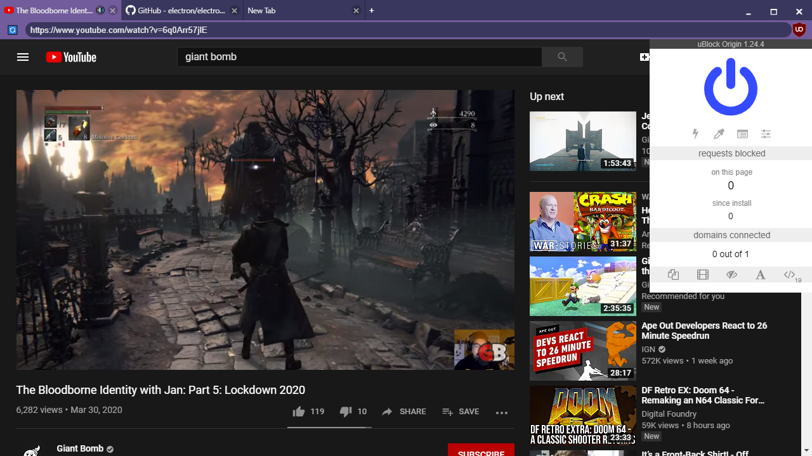

# electron-browser-shell

A minimal, tabbed web browser with support for Chrome extensions—built on Electron.



## Packages

| Name                                                                    | Description                                                                                  |
| ----------------------------------------------------------------------- | -------------------------------------------------------------------------------------------- |
| [shell](./packages/shell)                                               | A minimal, tabbed web browser used as a testbed for development of Chrome extension support. |
| [electron-chrome-extensions](./packages/electron-chrome-extensions)     | Adds additional API support for Chrome extensions to Electron.                               |
| [electron-chrome-context-menu](./packages/electron-chrome-context-menu) | Chrome context menu for Electron browsers.                                                   |
| [electron-chrome-web-store](./packages/electron-chrome-web-store)       | Download extensions from the Chrome Web Store in Electron.                                   |

## Usage

```bash
# Get the code
git clone git@github.com:samuelmaddock/electron-browser-shell.git
cd electron-browser-shell

# Install and launch the browser
yarn
yarn start
```

### Install extensions

Navigate to the [Chrome Web Store](https://chromewebstore.google.com/) and install an extension.

To test local unpacked extensions, include them in `./extensions` then launch the browser.

## Roadmap

### 🚀 Current

- [x] Browser tabs
- [x] Unpacked extension loader
- [x] Initial [`chrome.tabs` extensions API](https://developer.chrome.com/extensions/tabs)
- [x] Initial [extension popup](https://developer.chrome.com/extensions/browserAction) support
- [x] .CRX extension loader
- [x] [Chrome Web Store](https://chromewebstore.google.com) extension installer
- [x] Automatic extension updates
- [x] [Manifest V3](https://developer.chrome.com/docs/extensions/mv3/intro/) support—pending [electron/electron#44411](https://github.com/electron/electron/pull/44411)
- [ ] Support for common [`chrome.*` extension APIs](https://developer.chrome.com/docs/extensions/reference/api)
- [ ] Robust extension popup support
- [ ] Respect extension manifest permissions

### 🤞 Eventually

- [ ] Extension management (enable/disable/uninstall)
- [ ] Installation prompt UX
- [ ] [Microsoft Edge Add-ons](https://microsoftedge.microsoft.com/addons/Microsoft-Edge-Extensions-Home) extension installer
- [ ] Full support of [`chrome.*` extension APIs](https://developer.chrome.com/docs/extensions/reference/api)

### 🤔 Considering

- [ ] Opt-in support for custom `webRequest` blocking implementation
- [ ] Browser tab discarding

### ❌ Not planned

- [Chrome Platform App APIs](https://developer.chrome.com/docs/extensions/reference/#platform_apps_apis)

## License

Most packages in this project use MIT with the exception of electron-chrome-extensions.

For proprietary use, please [contact me](mailto:sam@samuelmaddock.com?subject=electron-browser-shell%20license) or [sponsor me on GitHub](https://github.com/sponsors/samuelmaddock/) under the appropriate tier to [acquire a proprietary-use license](https://github.com/samuelmaddock/electron-browser-shell/blob/master/LICENSE-PATRON.md). These contributions help make development and maintenance of this project more sustainable and show appreciation for the work thus far.

### Contributor license agreement

By sending a pull request, you hereby grant to owners and users of the
electron-browser-shell project a perpetual, worldwide, non-exclusive,
no-charge, royalty-free, irrevocable copyright license to reproduce, prepare
derivative works of, publicly display, publicly perform, sublicense, and
distribute your contributions and such derivative works.

The owners of the electron-browser-shell project will also be granted the right to relicense the
contributed source code and its derivative works.
